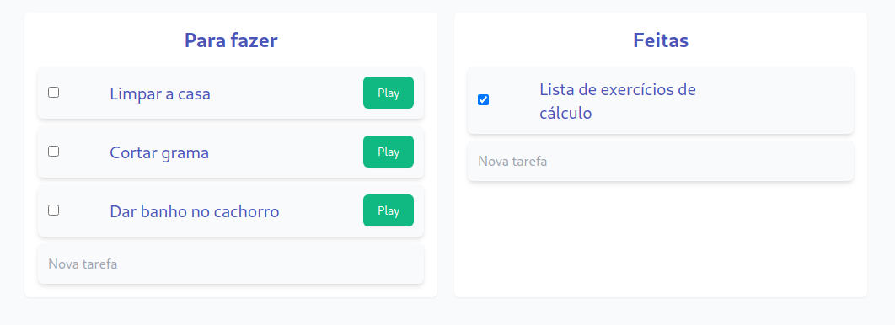
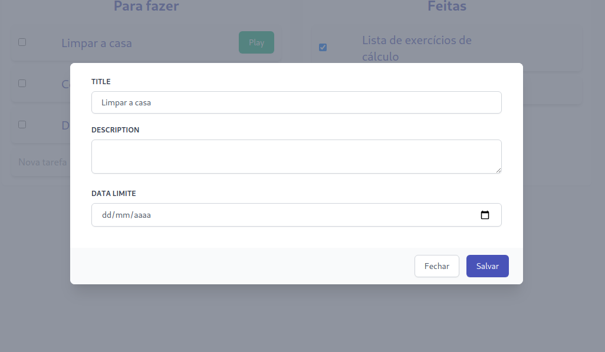
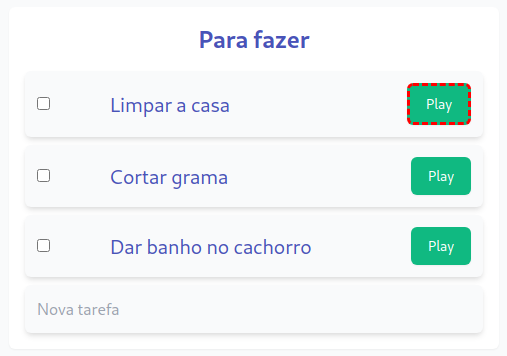
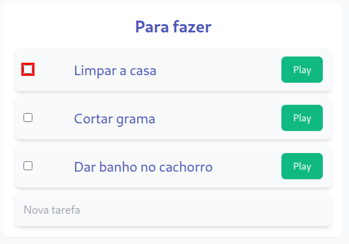
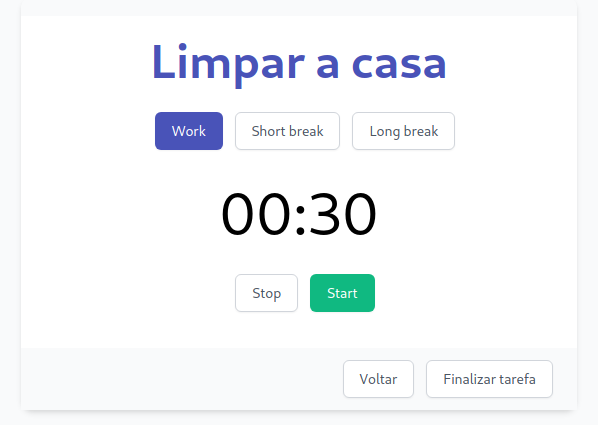

# Funcionalidades

## Criar tarefa
Para criar uma tarefa basta simplesmente informar um título e teclar Enter que a tarefa será adicionada na respectiva lista em que ela foi criada, esta pode ser a lista de tarefas <b>feitas</b> caso deseja-se somente documenta-la, ou <b>a fazer</b> caso ela ainda não foi concluída, como pode ser visto na imagem a seguir.

    

## Preencher informações adicionais
Ao clicar sobre uma tarefa é possível preencher informações adicionais como <b>descrição</b> e <b>data limite</b>, como pode ser verificado na imagem a seguir, informações que irão auxiliar no melhor controle de seus afazeres.

    

## Iniciar tarefa
Após criada a tarefa já é possível colocá-la em execução, para isso basta clicar no botão <b>"Play"</b> assim como é destacado na imagem a seguir.

    

Caso você já tenha finalizado uma determinada tarefa, ou ela não é mais uma prioridade é possível marcá-la como <b>feita</b> sem a necessidade de iniciar o ciclo do pomodoro, para isso basta marcar o <i>checkbox</i> presente na tarefa, como destacado a seguir. O mesmo vale caso uma tarefa já foi finalizada e deseja-se torná-la executável novamente, para isso basta desmacar o <i>checkbox</i> mencionado.

    

## Acompanhar o ciclo
Após iniciada uma tarefa, a seguinte tela será exibida, nela existe a opção <b>Work</b> que deve ser selecionada quando deseja-se de fato trabalhar na tarefa iniciada. Após selecionada a opção <b>Work</b> deve-se clicar na opção <b>Start</b>, ao fazer isso o ciclo será iniciado e o período de 25 minutos vai passar a ser contado. Durante esse tempo é possível parar a contagem através da opção <b>Stop</b>, uma vez nessa condição é possível dar dois tipos de pausa: a pausa curta de 5 minutos usando a opção <b> Short Break</b> caso a atividade desempenhada anteriormente não foi tão massante, ou a pausa longa de 15 minutos através da opção <b>Long Break</b> caso contrário.

    

